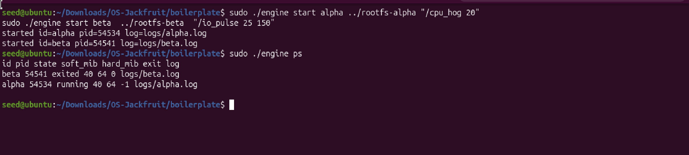
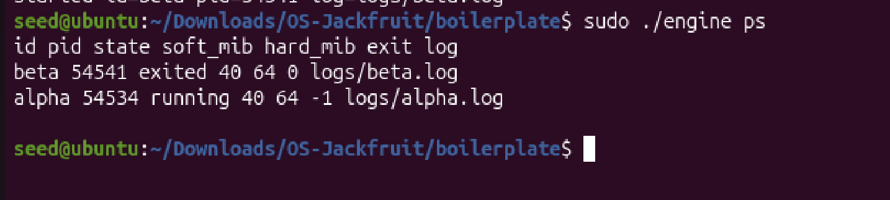
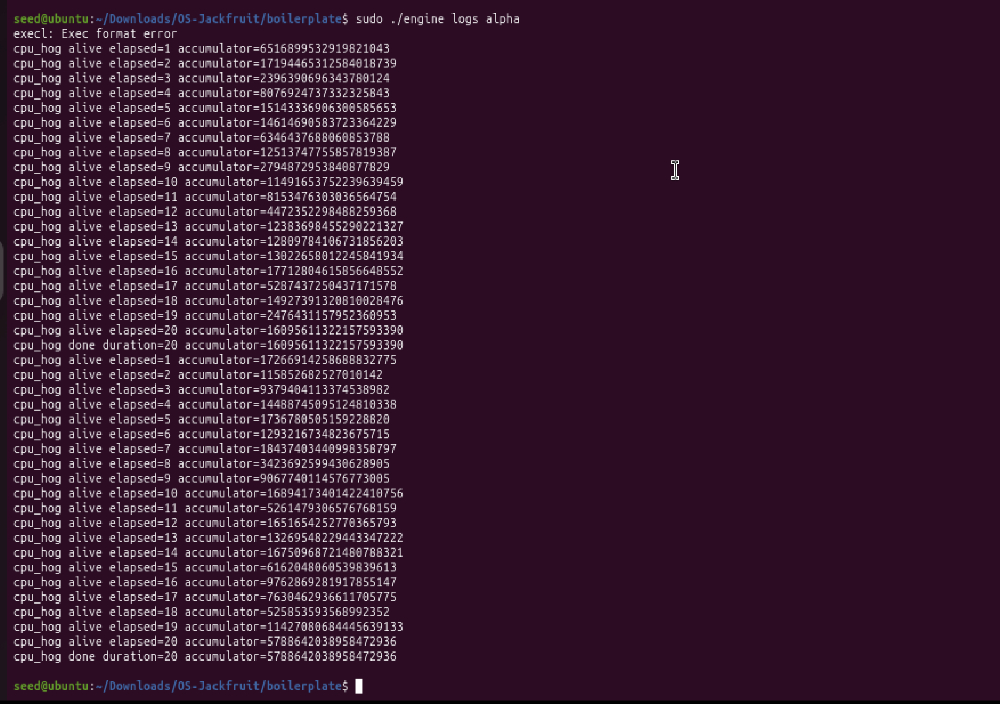
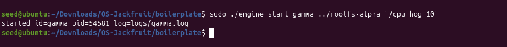
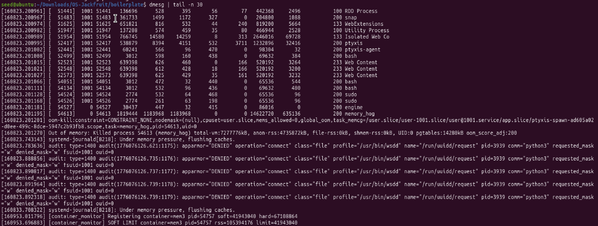
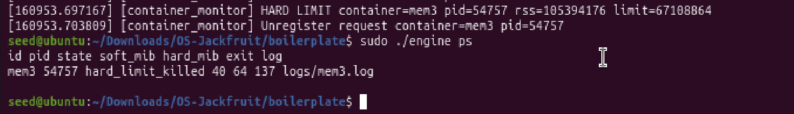
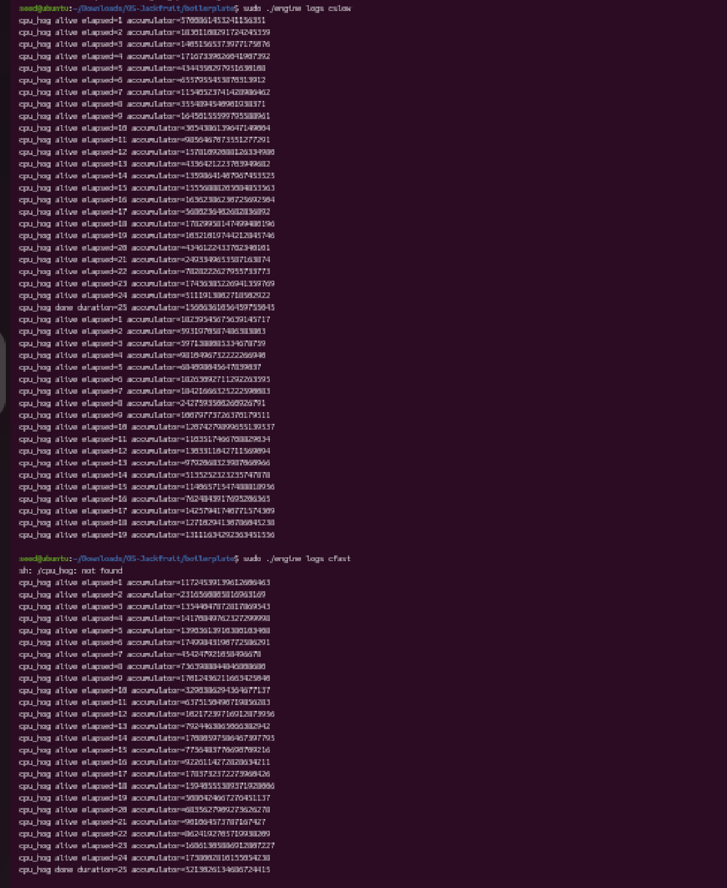
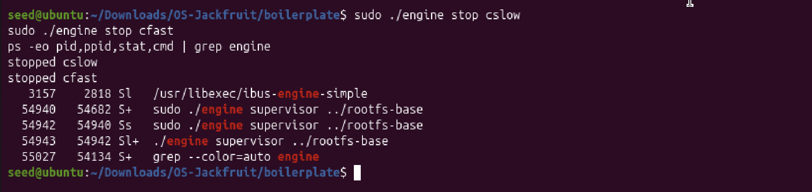

# Multi-Container Runtime

This repository implements a lightweight Linux container runtime in C with:

* a long-running parent supervisor in user space
* a bounded-buffer concurrent logging pipeline
* a kernel module that enforces soft and hard memory limits

Implementation files are in `boilerplate/`:

* `engine.c` — user-space runtime and supervisor
* `monitor.c` — kernel-space memory monitor
* `monitor_ioctl.h` — shared ioctl definitions
* `cpu_hog.c`, `io_pulse.c`, `memory_hog.c` — workloads
* `Makefile`

---

# 1. Team Information

* Name 1: V.Saatwik
* SRN 1: PES1UG24CS509
* Name 2: Varhit Gude 
* SRN 2: PES1UG24CS518

---

# 2. Build, Load, and Run Instructions

## Build

```bash
make
```

## Load kernel module

```bash
sudo insmod monitor.ko
ls -l /dev/container_monitor
```

## RootFS Setup (Ubuntu 25.10 ARM)

```bash
cd ~/Downloads/OS-Jackfruit

wget https://dl-cdn.alpinelinux.org/alpine/v3.20/releases/aarch64/alpine-minirootfs-3.20.3-aarch64.tar.gz

rm -rf rootfs-base rootfs-alpha rootfs-beta
mkdir rootfs-base

tar -xzf alpine-minirootfs-3.20.3-aarch64.tar.gz -C rootfs-base

cp -a rootfs-base rootfs-alpha
cp -a rootfs-base rootfs-beta
```

## Copy workloads

```bash
cp boilerplate/cpu_hog rootfs-alpha/
cp boilerplate/memory_hog rootfs-alpha/

cp boilerplate/cpu_hog rootfs-beta/
cp boilerplate/io_pulse rootfs-beta/

chmod +x rootfs-alpha/*
chmod +x rootfs-beta/*
```

## Start supervisor

```bash
cd boilerplate
sudo ./engine supervisor ../rootfs-base
```

## Start containers

```bash
sudo ./engine start alpha ../rootfs-alpha "/cpu_hog 20"
sudo ./engine start beta ../rootfs-beta "/io_pulse 25 150"

sudo ./engine ps
sudo ./engine logs alpha
```

## Memory experiment

```bash
sudo sysctl kernel.dmesg_restrict=0

sudo ./engine start mem3 ../rootfs-alpha "/memory_hog 50 500" --soft-mib 40 --hard-mib 64

dmesg | tail -n 30
sudo ./engine ps
```

## Scheduler experiment

```bash
sudo ./engine start cslow ../rootfs-alpha "/cpu_hog 25" --nice 15
sudo ./engine start cfast ../rootfs-beta "/cpu_hog 25" --nice -5

sudo ./engine logs cslow
sudo ./engine logs cfast
```

## Cleanup

```bash
sudo ./engine stop cslow
sudo ./engine stop cfast

ps -eo pid,ppid,stat,cmd | grep engine

sudo rmmod monitor
```

---

# 3. Demo with Screenshots

## 3.1 Multi-container supervision



**Caption:**
Two containers are started under a single long-running supervisor. The output shows that the supervisor tracks both containers concurrently.

---

## 3.2 Metadata tracking



**Caption:**
The engine ps output shows tracked metadata including container ID, PID, state, memory limits, and log path.

---

## 3.3 Bounded-buffer logging



**Caption:**
The engine logs output shows container stdout captured through the pipe → bounded buffer → log file pipeline.

---

## 3.4 CLI and IPC



**Caption:**
CLI sends commands to supervisor via UNIX socket and receives responses, demonstrating IPC separation.

---

## 3.5 Soft-limit warning



**Caption:**
Kernel monitor logs a soft-limit event when memory exceeds advisory threshold.

---

## 3.6 Hard-limit enforcement



**Caption:**
Kernel enforces hard limit and kills container. Supervisor shows state as `hard_limit_killed`.

---

## 3.7 Scheduler experiment



**Caption:**
CPU workloads with different nice values demonstrate scheduling priority differences.

---

## 3.8 Clean teardown



**Caption:**
Containers are stopped and no zombie processes remain. Only supervisor processes exist.

---

# 4. Engineering Analysis

## 4.1 Isolation Mechanisms

This runtime uses Linux namespaces (PID, UTS, mount) and `chroot()` to isolate containers.
Each container has its own process space, hostname, and filesystem view.

However, the kernel is shared. This allows the kernel module to enforce memory limits globally.

---

## 4.2 Supervisor and Lifecycle

A persistent supervisor manages:

* container creation
* metadata
* logging
* reaping

Containers are tracked centrally, ensuring correct state transitions and cleanup.

---

## 4.3 IPC and Synchronization

Two IPC paths:

* pipes → logging
* UNIX socket → control

Synchronization:

* mutexes for metadata
* condition variables for bounded buffer

---

## 4.4 Memory Enforcement

* RSS used as memory metric
* soft limit → warning
* hard limit → SIGKILL

Kernel enforcement ensures correctness and avoids user-space races.

---

## 4.5 Scheduling Behavior

Experiments show:

* lower nice → higher priority
* CPU-bound vs IO-bound differences

Linux scheduler balances fairness and responsiveness.

---

# 5. Design Decisions and Tradeoffs

## Isolation

* Used `chroot` instead of `pivot_root`
* Simpler but slightly weaker isolation

## Supervisor

* Single supervisor simplifies control
* Adds concurrency complexity

## Logging

* bounded buffer prevents blocking
* adds synchronization overhead

## Kernel Monitor

* linked list used
* simpler but O(n) lookup

---

# 6. Scheduler Experiment Results

## CPU vs CPU

| Container | Nice | Result |
| --------- | ---- | ------ |
| cslow     | 15   | slower |
| cfast     | -5   | faster |

---

## CPU vs IO

| Container | Type | Behavior      |
| --------- | ---- | ------------- |
| cpu_hog   | CPU  | continuous    |
| io_pulse  | IO   | burst + sleep |

---

## Interpretation

Scheduler prioritizes:

* responsiveness for IO
* fairness for CPU

---

# 7. Ubuntu 25.10 Compatibility

This project was developed and tested on **Ubuntu 25.10 (ARM64 architecture)** inside a virtual machine environment. During development, several system-specific issues were encountered and resolved as follows:

---

### 7.1 Architecture Mismatch (Exec Format Error)

Initially, container workloads failed with:

```bash
exec: Exec format error
```

**Cause:**
The root filesystem and/or binaries were not compatible with the system architecture.

**Fix:**
An ARM64-compatible Alpine root filesystem was used:

```bash
wget https://dl-cdn.alpinelinux.org/alpine/v3.20/releases/aarch64/alpine-minirootfs-3.20.3-aarch64.tar.gz
```

All workload binaries (`cpu_hog`, `memory_hog`, `io_pulse`) were compiled inside the same ARM environment and copied into the rootfs.

---

### 7.2 Missing Binaries Inside Container (Exit Code 127)

Containers initially exited with:

```bash
status=127
sh: /cpu_hog: not found
```

**Cause:**
The workload binaries were not present inside the container root filesystem or were not executable.

**Fix:**
Binaries were explicitly copied and permissions fixed:

```bash
cp boilerplate/cpu_hog rootfs-alpha/
cp boilerplate/io_pulse rootfs-beta/

chmod +x rootfs-alpha/*
chmod +x rootfs-beta/*
```

After this, containers executed workloads successfully.

---

### 7.3 Supervisor Not Running (IPC Failure)

Error observed:

```bash
connect: No such file or directory
```

**Cause:**
The CLI attempted to communicate with the supervisor before it was started.

**Fix:**
Ensure supervisor is running before issuing commands:

```bash
sudo ./engine supervisor ../rootfs-base
```

This initializes the UNIX domain socket used for IPC.

---

### 7.4 dmesg Access Restriction

Kernel logs initially failed with:

```bash
dmesg: read kernel buffer failed: Operation not permitted
```

**Cause:**
Ubuntu restricts access to kernel logs by default.

**Fix:**
Temporarily disable restriction:

```bash
sudo sysctl kernel.dmesg_restrict=0
```

This allowed observation of soft and hard memory limit enforcement.

---

### 7.5 Root-Owned Files and Permission Issues

Certain directories (e.g., `logs/`) were created with root ownership due to use of `sudo`.

**Issue:**
Normal user could not delete or modify these files.

**Fix:**
Either remove using sudo:

```bash
sudo rm -rf boilerplate/logs
```

Or reset ownership:

```bash
sudo chown -R seed:seed boilerplate/
```

---

### 7.6 Root Filesystem Placement

The root filesystem directories (`rootfs-alpha`, `rootfs-beta`, etc.) were initially created both inside and outside the `boilerplate/` directory.

**Resolution:**
A consistent structure was adopted:

* rootfs directories placed at project root
* engine executed from `boilerplate/` using relative paths

---